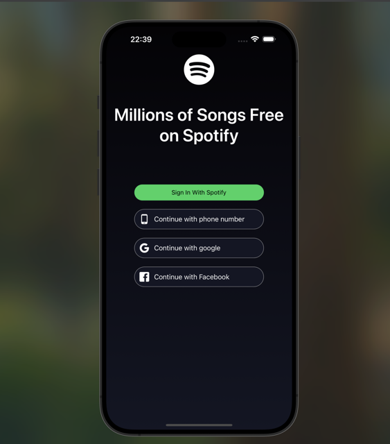
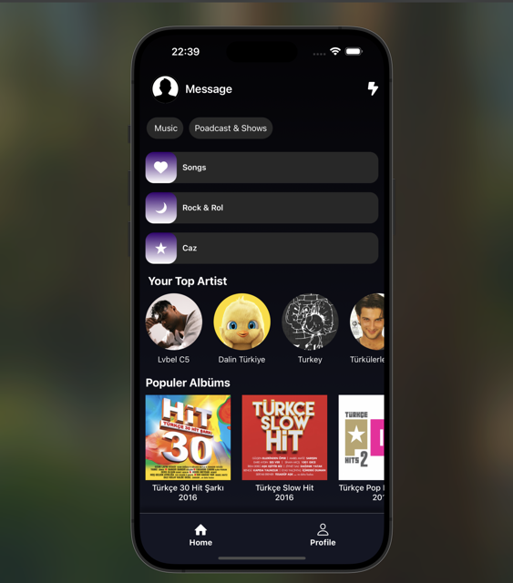
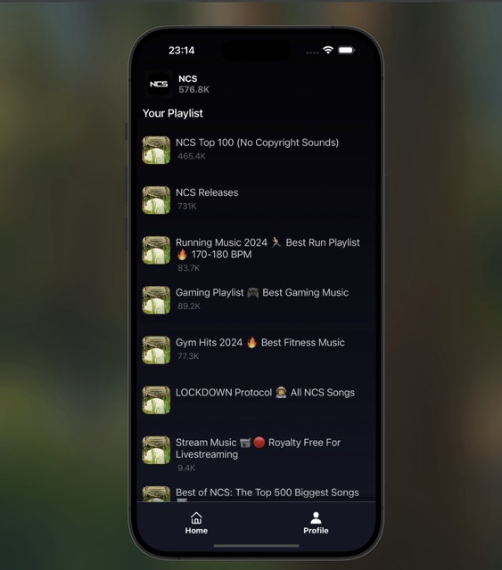
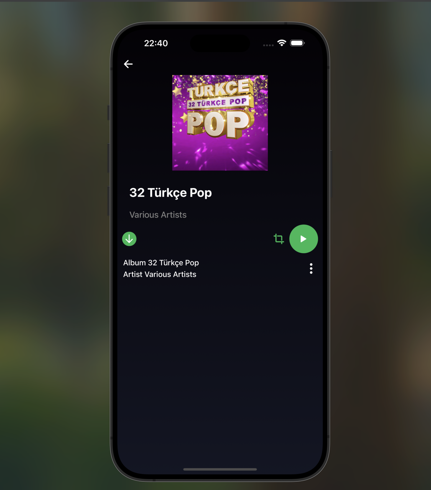
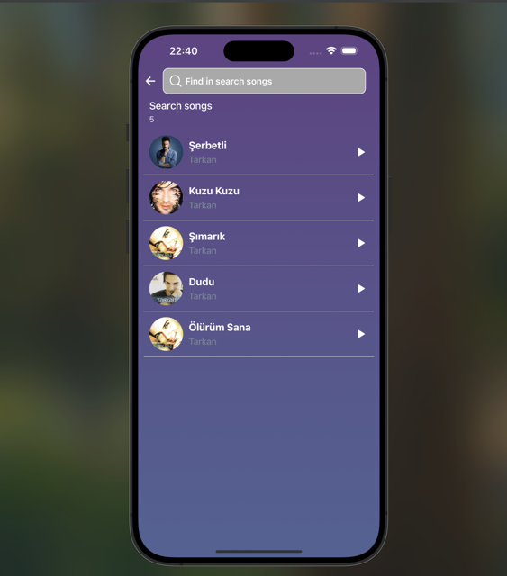
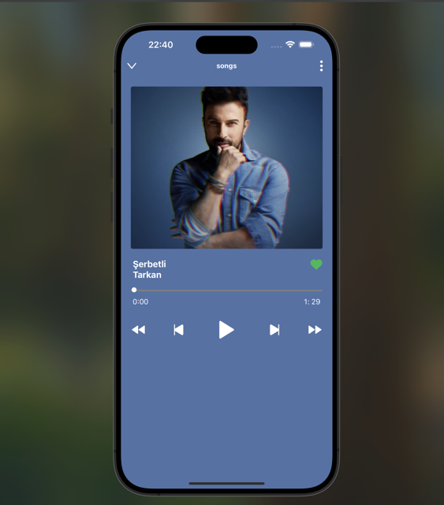

# Spotify-Clone-(React Native)

This project is a Spotify Clone built using React Native. The application fetches data from RapidAPI and allows users to browse and play popular music. It mimics the basic functionality and design of Spotify, providing a seamless user experience.

## Screenshots 🖼️

### Video GIF


### LoginScreen



### HomeScreen



### ProfileScreen



### SongInfoScreen



### SongScreen



### Modal



## Features

- Browse Popular Music: Users can explore a curated list of trending and popular tracks.

- Play Music: Tap on any track to play music directly in the app.

- Dynamic Data Fetching: Fetches real-time data from RapidAPI to display up-to-date music information.

- User-Friendly Interface: The app features an intuitive and visually appealing design inspired by Spotify.

## Technologies Used

- React Native: For building the cross-platform mobile application.

- RapidAPI: To fetch music data and metadata.

- React Navigation: For smooth navigation between different screens (if applicable).

- State Management: Managed using CONTEXTAPI and React's built-in state management tools (e.g., useState, useEffect).

- Icons and Styling: Utilizes libraries like React Native Vector Icons and custom styling for a polished look.

## Libraries and Dependencies

Here are the libraries and dependencies used in this project:

- @react-navigation/bottom-tabs: ^7.2.0

- @react-navigation/native: ^7.0.14

- @react-navigation/native-stack: ^7.2.0

- axios: ^1.7.9
-
- lodash: ^4.17.21

- react: 18.3.1

- react-native: 0.75.4

- react-native-linear-gradient: ^2.8.3

- react-native-modal: ^13.0.1

- react-native-safe-area-context: ^5.0.0

- react-native-screens: ^4.4.0

- react-native-track-player: ^4.1.1

- react-native-vector-icons: ^10.2.0

## Installation

Follow these steps to run the project on your local machine:

Clone the Repository:

```
git clone https://github.com/ozerbaykal/SpotifyClone-Native.git
```

Navigate to the Project Directory:

```
cd spotify-clone-react-native
```

Install Dependencies:

```
npm install

# or

yarn install
```

Start the Metro Bundler:

```
npx react-native start
```

Run the Application:

For iOS:

```
npx react-native run-ios
```

For Android:

```
npx react-native run-android
```

## Contributing

Contributions are welcome! Please open an issue first to discuss what you would like to change.

- 1.Fork the project
- 2.Create your feature branch (git checkout -b feature/NewFeature)
- 3.Commit your changes (git commit -m 'Add new feature')
- 4.Push to the branch (git push origin feature/NewFeature)
- 5.Open a Pull Request

## Contact 📬

**Özer BAYKAL**  
Email: [baykalozer87@gmail.com](mailto:baykalozer87@gmail.com)  
Project Link: [spotifyCloneReactNative](https://github.com/ozerbaykal/spotify-clone-react-native)
